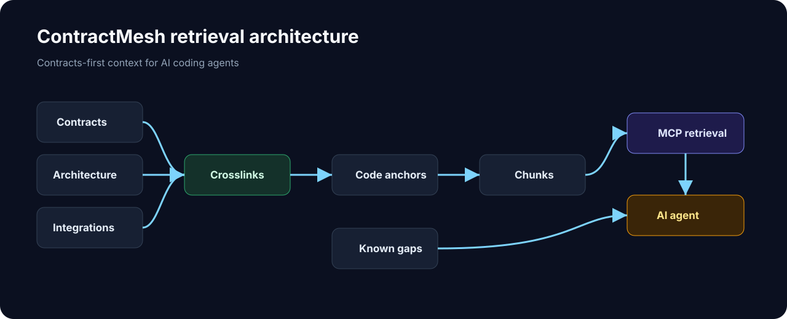

# Architecture

ContractMesh turns explicit workspace knowledge into an auditable engineering
knowledge layer for AI agents.

This document describes the product architecture. For contributor setup, see
[Local development](dev-local.md).

MCP is not the product. MCP is the protocol that exposes the knowledge layer to
agents. The durable value is the workspace graph formed by contracts,
ownership, ADRs, architecture, code anchors, crosslinks, known gaps and
provenance.



## Pipeline

1. Repository docs define contracts, ownership, ADRs, architecture,
   integrations and known gaps.
2. The indexer extracts metadata and chunks from those docs.
3. Code anchor extraction locates implementation symbols in source files.
4. Crosslinking connects docs to code anchors by symbol.
5. Provenance records which docs, anchors and chunks support an answer.
6. MCP tools expose structured retrieval to agents.
7. Agent rules define when to retrieve, when to read code and how to cite
   sources.

## Main components

| Component | Role |
| --- | --- |
| `contractmesh/engine/build_search_index.py` | Builds manifest, local metadata and chunks. |
| `contractmesh/engine/build_code_anchors.py` | Extracts source-level anchors from Java, Kotlin, TypeScript, Go, Python, and YAML. |
| `contractmesh/engine/build_contract_crosslinks.py` | Links contracts, architecture and integrations to anchors. |
| `contractmesh/engine/workspace_search.py` | Ranking, snippets, gaps, chunks and status. |
| `contractmesh/mcp/server.py` | MCP protocol surface exposing the knowledge layer. |

Compatibility shims under `scripts/` may call the same engine modules.

## Knowledge layer

The knowledge layer is intentionally local and deterministic:

```text
Workspace
-> Contracts
-> Ownership
-> ADRs
-> Architecture
-> Code Anchors
-> Crosslinks
-> Known Gaps
-> Provenance
-> MCP tools
-> Agent grounded response
```

Tools such as Cursor, Claude Code, Gemini CLI, Roo, Cline and OpenHands can
consume the same MCP surface. ContractMesh should remain useful even as agent
clients change.

## Generated artifacts

| Artifact | Purpose |
| --- | --- |
| `.contractmesh/index/search-index.manifest.json` | Portable metadata: docs, anchors, kinds, gaps and crosslinks. |
| `.contractmesh/index/search-index.local.json` | Machine-local paths and hashes. |
| `.contractmesh/index/chunks/` | JSONL chunk files. |

Generated artifacts are ignored by Git by default.
